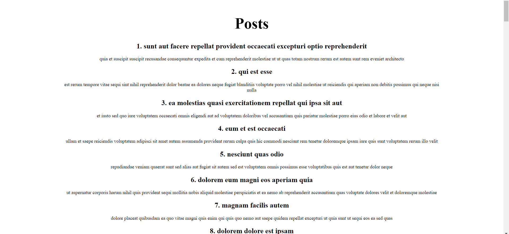

# DJS10 - Asynchrony

## Objective

Dived into the asynchronous world of React by creating an application that fetches and displays blog posts from an API. I practiced handling API calls with the Fetch API, managing application state, and gracefully handling errors.

## Project Showcase

